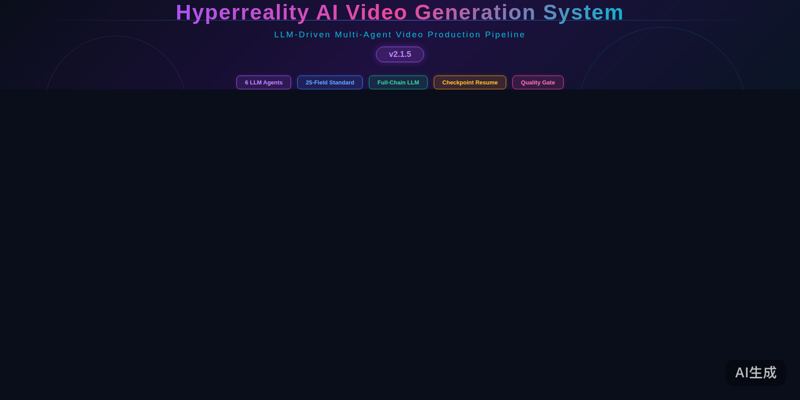
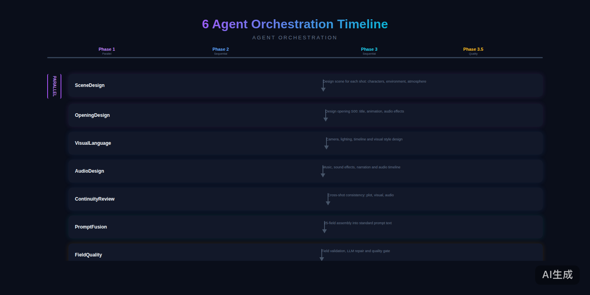
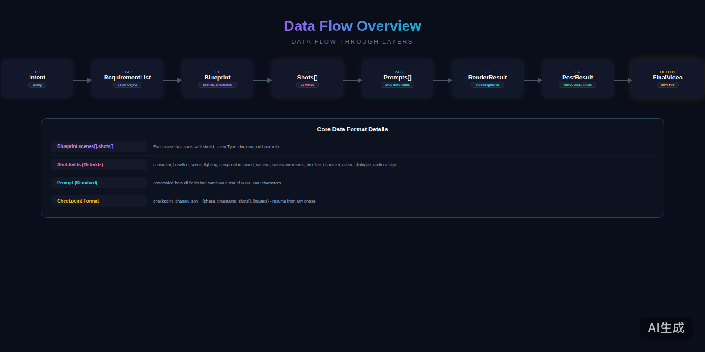
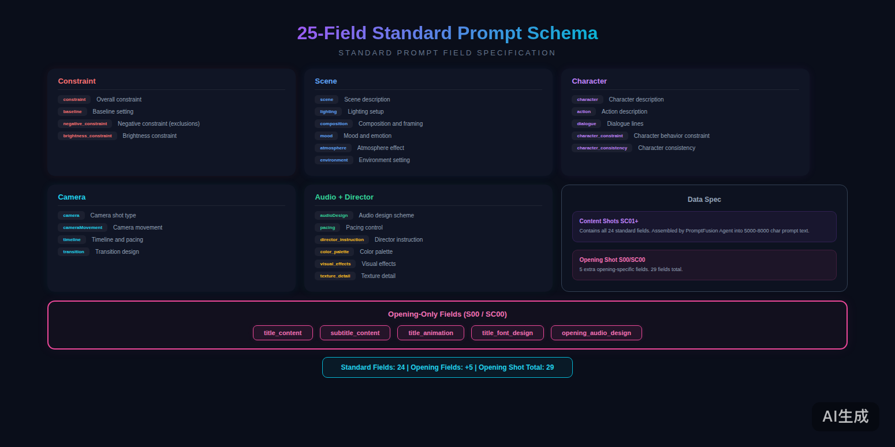
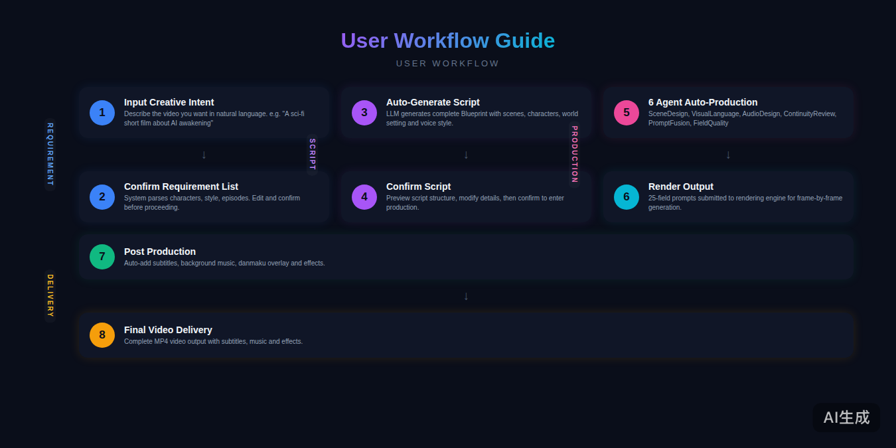
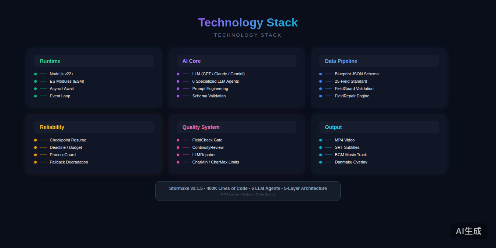
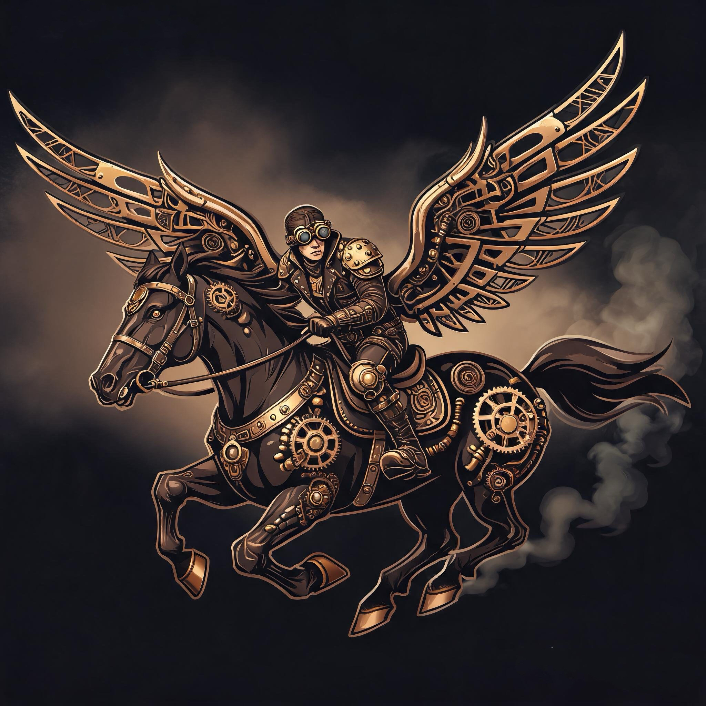
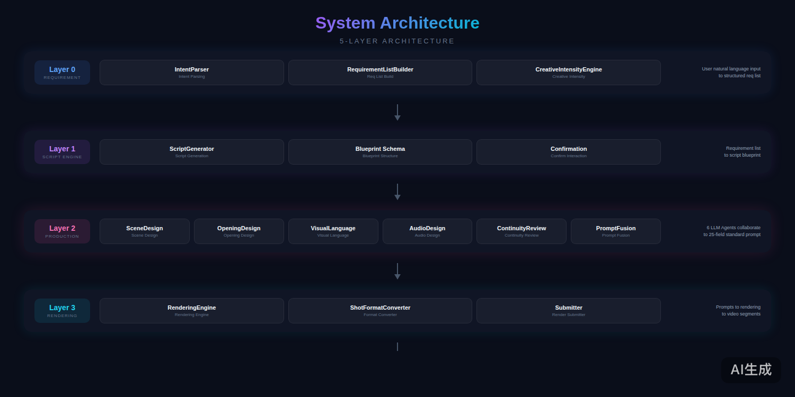
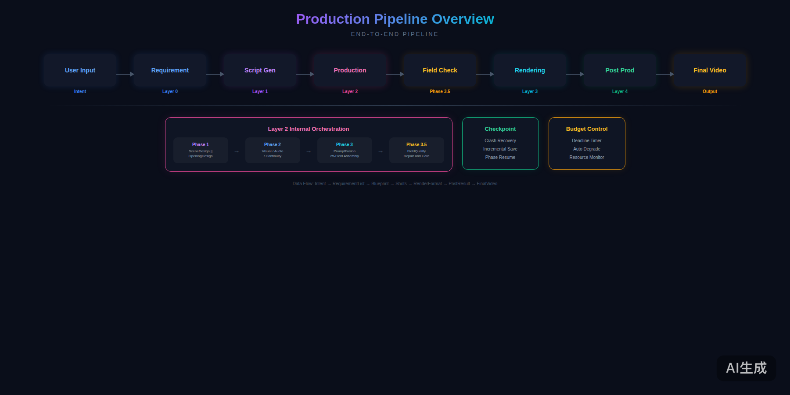

# Hyperreal AI Video System (HAVS) — 超现实工业AI视频制作系统

[](https://github.com/yourusername/hyperreality-system)
[](LICENSE)
[](https://github.com/yourusername/hyperreality-system/releases)
[](https://nodejs.org/)

> **这不是又一个文生视频玩具，而是一套面向电影工业级标准的AI视频预生产系统。**
>
> 从经典电影工业中解构运镜语法，将 Harness 架构、Multi-Agent 协作、影视领域 Skills 融合转化为系统化的镜头语言工程。
> **剧本是灵魂，运镜是骨架，真实感是底线。**

<details>
<summary>🇬🇧 <strong>English Version</strong> (Click to expand)</summary>

## Hyperreal AI Video System (HAVS)

> **This is not another text-to-video toy, but an AI video pre-production system built to cinematic industrial standards.**
>
> I deconstruct cinematographic grammar from classic film language, fusing Harness Architecture, Multi-Agent Collaboration, and film & television domain skills into a systematic camera language engineering practice. Through a four-layer decoupled architecture—**Script Engine, Generation Engine, Rendering Engine, and Post-Production Engine**—HAVS enables AI to truly comprehend cinematic language rather than merely generating pixels.
>
> **The script is the soul, camera movement is the skeleton, and photorealism is the baseline.**
>
> By open-sourcing this system, I hope to connect with creators and engineers equally obsessed with **"using AI to tell great stories"**—to push AI video from merely watchable to genuinely moving, and redefine content production paradigms in the digital age.
>
> This system helps you **Harness Your Imagination**.

---

**I'm Genius**, an AI Product Manager and expert in AI-powered automated content production with over a decade of experience. I currently serve as an AI Product Manager at Alibaba's Qwen Business Group, and have previously held positions at Alibaba Group, Alibaba Cloud, and Ant Group, where I led products serving hundreds of millions of users and drove full-stack 0-to-1 builds—from underlying model chains to consumer-facing applications—encompassing Harness Architecture, Multi-Agent Collaboration, and Workflow Orchestration. As early as 2018, I led Alibaba Cloud's algorithm team to introduce AI pipelines into media content production. I firmly believe that when AI understands industrial-grade workflows, content production will explode exponentially.

In recent years, I have been dedicating my spare time to building a multimodal AI video production project. Now, based on Seedance 2.0 and its subsequent versions, I am developing a fully automated AI video generation system that simulates Hollywood industrial filmmaking—**Hyperreal AI Video System (HAVS)**.

Feel free to reach out at **63904380@qq.com**.

</details>

---

## 作者介绍

**我是 Genius**，一名深耕AI产品经理与AI内容自动化生成领域产品专家，从业十余年，现在是阿里巴巴千问事业群AI产品经理，曾任职于阿里巴巴集团、阿里云及蚂蚁金服，主导过数亿用户的产品，从底层模型链路到C端应用的全链路0-1建设——覆盖 Harness 架构、Multi-Agent 协作与 Workflow 编排的AI应用体系；在2018年就带领阿里云算法团队将AI流水线引入媒体内容生产，我坚信：**当AI理解工业化节奏，内容生产必将指数级爆发。**

我近几年一直业余时间打造基于AI多模态的视频剪辑项目，现在是基于 Seedance 2.0 及后续版本打造模拟好莱坞工业电影制作的全自动AI视频生成系统——**Hyperreal AI Video System（HAVS）**。

开源这套系统，是希望找到同样痴迷于**"用AI讲好故事"**的创作者与开发者，一起把AI视频从"能看"推向"动人"，重新定义数字时代的内容生产范式。

这套系统帮你**"驾驭想象力"**。

我是 Genius，欢迎与我交流 **63904380@qq.com**。

---



*<center>核心能力矩阵 — 6大Agent × 25字段标准 × 全链路LLM驱动</center>*

---

### 6 Agent 编排时间线



*<center>7大Agent跨Phase协作 — 从场景设计到质量门控</center>*

### 数据流概览



*<center>核心数据流 — 从用户意图到最终成片的数据链路</center>*

### 25字段标准化提示词结构



*<center>工业级镜头语言标准 — 24标准字段 + 5片头专属字段</center>*

---

## 🎯 功能特性与商业化场景

| 特性 | 说明 | 商业化场景 |
|------|------|-----------|
| 🎬 **电影级预生产流水线** | 剧本→制作→渲染→后期，四层解耦架构 | 短视频MCN机构批量生产、广告公司TVC预演 |
| 🤖 **Multi-Agent 智能协作** | 剧本Agent、导演Agent、运镜Agent、后期Agent各司其职 | 大幅降低人工分镜和脚本撰写成本 |
| 📝 **25字段标准化镜头语言** | 从导演指令到角色一致性，工业级字段契约 | 保证多镜头、多集数之间的风格和角色一致性 |
| 🎭 **角色定妆照系统** | 支持 reference image 引用，确保角色跨镜头一致 | 系列IP内容、虚拟偶像、品牌代言人视频 |
| ⚡ **Harness 异步架构** | 支持断点续传、Checkpoint恢复、并行渲染 | 大规模生产环境稳定运行，单任务失败不影响整体 |
| 🔍 **智能质量门** | 字段检查 + 规则校验 + LLM修复，三重质量保障 | 减少渲染失败和返工率 |

### 核心卖点

1. **🎬 不是玩具，是工业工具** — 面向好莱坞级别的镜头语言工程，不是简单的"生成一段视频"
2. **🧠 AI 理解电影感** — 通过剧本引擎和导演优化，让AI真正理解叙事节奏、情绪曲线、运镜语法
3. **⚡ 全自动流水线** — 从一句话创意到完整分镜脚本，全流程自动化，人工仅需审核
4. **🔄 系列内容一致性** — 跨集角色、风格、世界观保持一致，适合长系列内容生产
5. **🛡️ 企业级稳定性** — 进程守护、断点续传、错误隔离，生产环境可用

---

## 🚀 快速开始

### 用户工作流



*<center>8步端到端工作流 — 从创意意图到最终成片</center>*

### 环境要求

- **Node.js** >= 18.0.0
- **火山引擎账号**（用于 Seedance 2.0 视频渲染 / Seedream 图片生成）
- **API Key**（支持 Volcengine Ark / Kimi / OpenAI 兼容接口）

### 安装

```bash
# 克隆仓库
git clone https://github.com/yourusername/hyperreality-system.git
cd hyperreality-system

# 安装依赖
npm install

# 配置环境变量
cp .env.example .env
# 编辑 .env，填入你的 VOLCENGINE_ARK_API_KEY
```

### 最小可运行示例

```javascript
const { HyperrealitySystem } = require('./index');

async function main() {
  const system = new HyperrealitySystem({ version: 'v1.0.0' });

  const result = await system.create(
    '创作一集健康科普短视频，主题：运动损伤的预防与处理',
    {
      title: '运动损伤预防科普',
      target_duration: 55,
      series: '健康生活系列',
      episode: 1
    },
    {
      skipPromptReview: false,   // 开启提示词审核
      skipRender: false,         // 开启渲染
      skipPostProduction: false  // 开启后期制作
    }
  );

  console.log('✅ 预生产完成！', result);
}

main();
```

运行：

```bash
node examples/minimal-example.js
```

---

## 🏗️ 系统架构

```
┌─────────────────────────────────────────────────────────────────────┐
│                        Hyperreal AI Video System                    │
│                              (HAVS)                                 │
├─────────────────────────────────────────────────────────────────────┤
│                                                                     │
│  ┌─────────────────────────────────────────────────────────────┐   │
│  │  Layer 1: 剧本引擎 (Script Engine)                         │   │
│  │  • 需求解析 → 创意生成 → 剧本结构 → 角色/世界观提取          │   │
│  │  • 输出：结构化剧本、角色配置、场景列表                       │   │
│  └─────────────────────────────────────────────────────────────┘   │
│                              ↓                                     │
│  ┌─────────────────────────────────────────────────────────────┐   │
│  │  Layer 2: 制作引擎 (Production Engine)                     │   │
│  │  • 分镜设计 → 提示词融合 → 导演优化 → 质量门               │   │
│  │  • 输出：25字段标准化镜头、视觉提示词、审核报告              │   │
│  └─────────────────────────────────────────────────────────────┘   │
│                              ↓                                     │
│  ┌─────────────────────────────────────────────────────────────┐   │
│  │  Layer 3: 渲染引擎 (Rendering Engine)                      │   │
│  │  • 视频渲染 → 图片生成 → 进度追踪 → 结果管理               │   │
│  │  • 支持：Seedance 2.0 / 自定义渲染后端                       │   │
│  └─────────────────────────────────────────────────────────────┘   │
│                              ↓                                     │
│  ┌─────────────────────────────────────────────────────────────┐   │
│  │  Layer 4: 后期引擎 (Post-Production Engine)              │   │
│  │  • 音频设计 → 标题优化 → 连续性检查 → 输出组装             │   │
│  └─────────────────────────────────────────────────────────────┘   │
│                                                                     │
│  ┌─────────────────────────────────────────────────────────────┐   │
│  │  横向支撑：进程守护 / Checkpoint / 字段标准化 / 质量流水线  │   │
│  └─────────────────────────────────────────────────────────────┘   │
│                                                                     │
└─────────────────────────────────────────────────────────────────────┘
```

> 📐 更详细的架构说明见 [docs/ARCHITECTURE.md](docs/ARCHITECTURE.md)

---

## 🛠️ 技术栈



*<center>六大技术维度 — Runtime / AI Core / Data Pipeline / Reliability / Quality System / Output</center>*

---

## 📚 文档目录

| 文档 | 说明 |
|------|------|
| [docs/ARCHITECTURE.md](docs/ARCHITECTURE.md) | 系统架构与模块详细说明 |
| [docs/CONTRIBUTING.md](docs/CONTRIBUTING.md) | 贡献规范、分支策略、PR模板 |
| [docs/CHANGELOG.md](docs/CHANGELOG.md) | 版本历史与更新记录 |
| [docs/FAQ.md](docs/FAQ.md) | 常见问题解答 |
| [docs/interface-contract-v1.md](docs/interface-contract-v1.md) | 系统接口契约规范 |
| [docs/short-video-prompt-schema-v6.37-production.md](docs/short-video-prompt-schema-v6.37-production.md) | 短视频提示词数据结构规范 |

---

## 🎨 项目展示

### Logo



*<center>蒸汽朋克飞马 — 驾驭想象力</center>*

### 系统架构图



*<center>5-Layer 工业级架构 — 从意图到成片</center>*

### 生产流水线总览



*<center>端到端流水线 — 用户意图到最终成片的全链路</center>*

---

## 🤝 贡献与社区

欢迎 Issue、PR 和讨论！

- 🐛 发现 Bug？请提交 [Issue](https://github.com/yourusername/hyperreality-system/issues)
- 💡 有新想法？请开启 [Discussion](https://github.com/yourusername/hyperreality-system/discussions)
- 🔧 想贡献代码？请阅读 [CONTRIBUTING.md](docs/CONTRIBUTING.md)

---

## 📧 联系方式

- **Email**: 63904380@qq.com
- **GitHub**: [yourusername/hyperreality-system](https://github.com/yourusername/hyperreality-system)

---

## 📜 License

[Apache License 2.0](LICENSE) © 2024-2026 Hyperreal AI Video System Contributors

---

> **"当AI理解工业化节奏，内容生产必将指数级爆发。"**
>
> — Genius, Creator of HAVS

