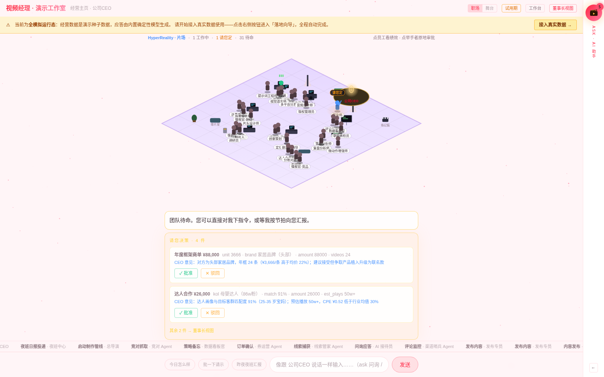
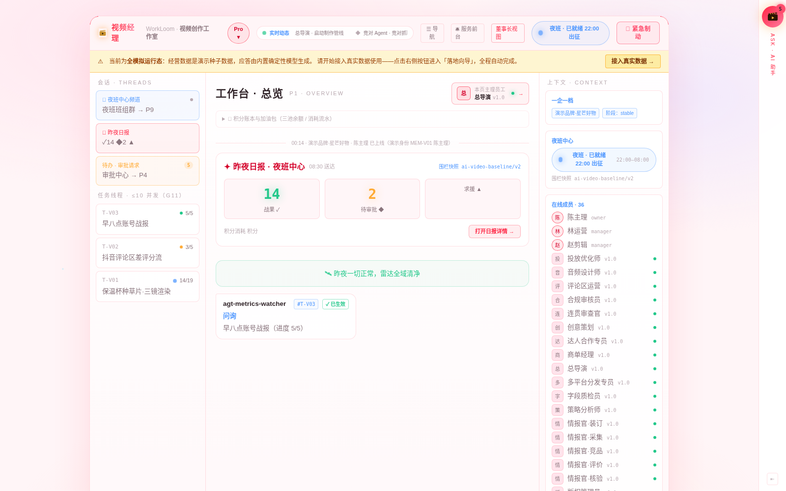
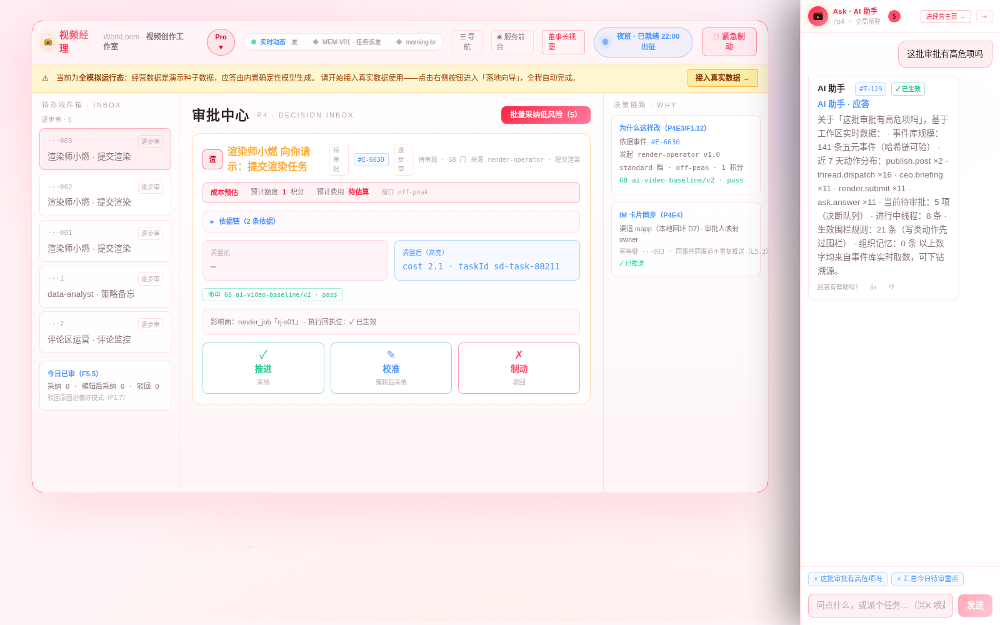
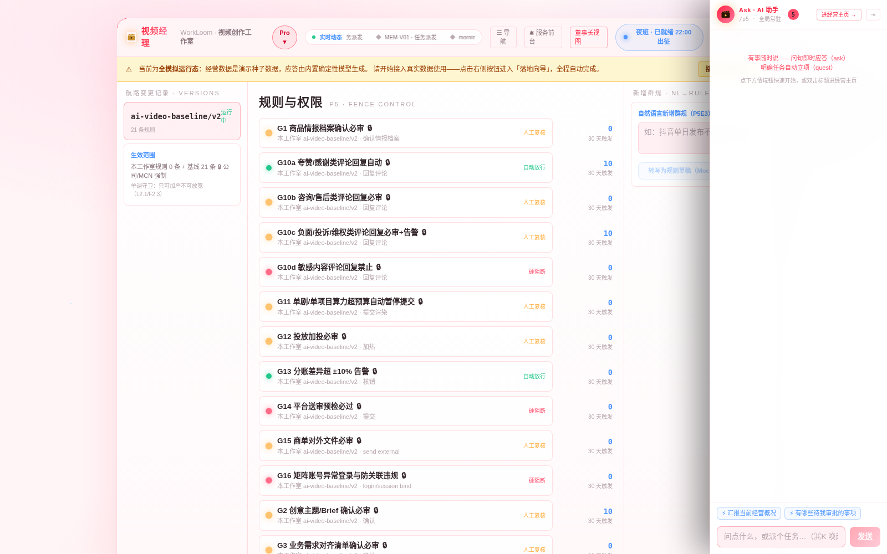
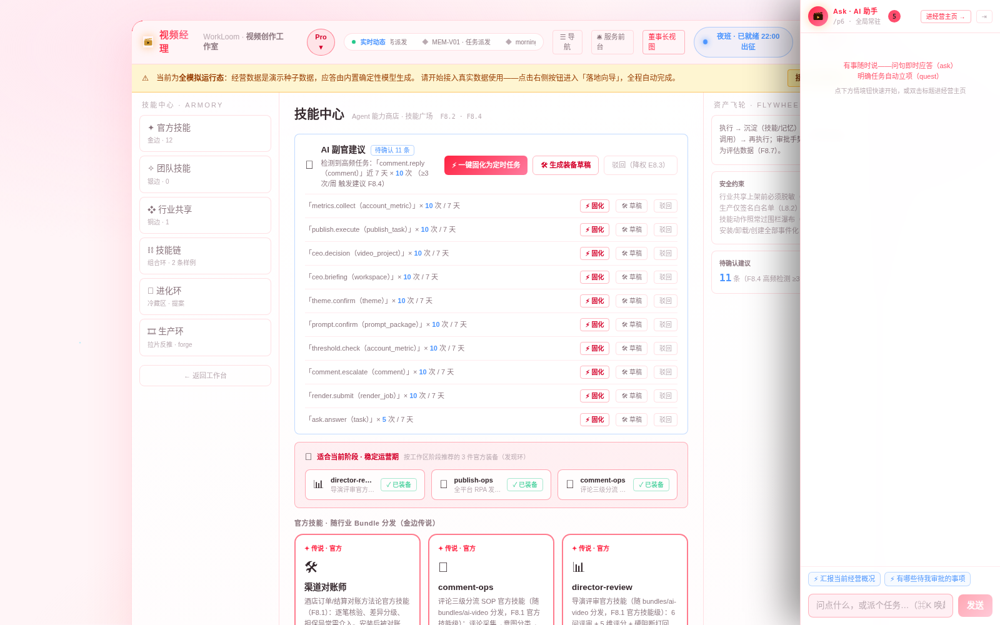
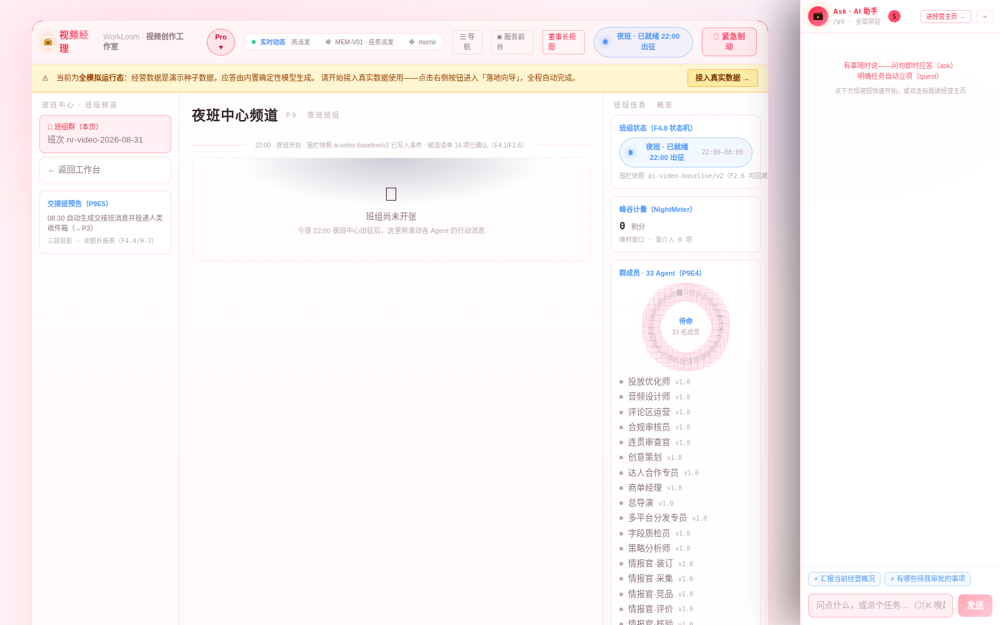
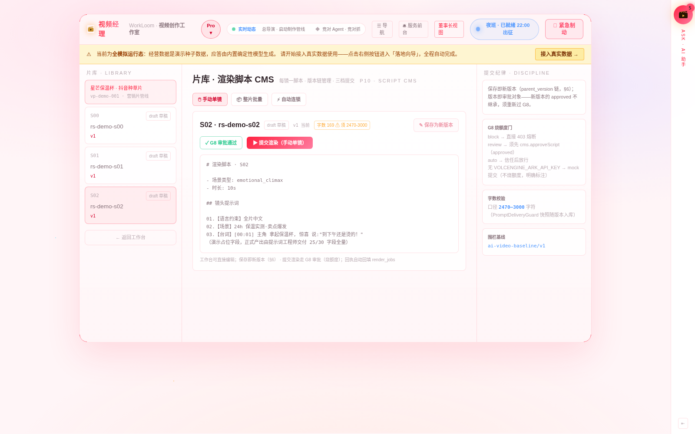
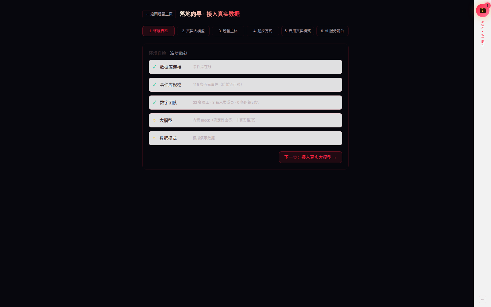
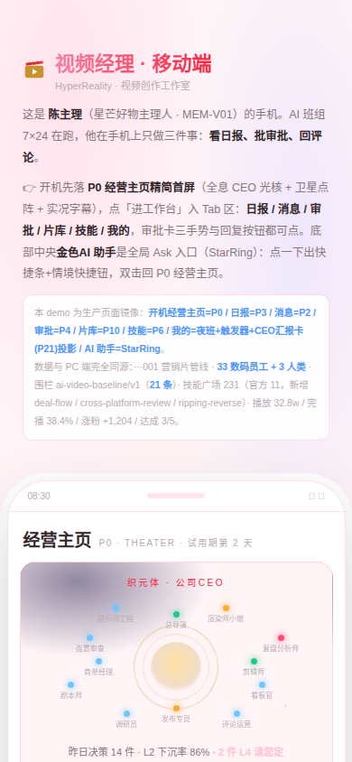

<div align="center">

# HyperReality · AI 视频制作智能经营系统

**别再抽卡了。把 AI 视频创作，变成一门可控、可复盘、可增长的生意。**

一支 25 人的 AI 制作班组住进你的通讯录，从选题调研到评论区回复，全链路替你干活——
你只做三件事：**定方向、拍板、收钱。**

[](LICENSE)
[](https://github.com/geniusdapeng-collab/hyperreality-system)

</div>

---

## 产品定位

HyperReality 是一套**开源的 AI 视频制作智能经营系统**：它把「AI 生成视频」从碰运气的抽卡游戏，升级为一条有班组、有纪律、有账本的内容生产线。

如果你用 AI 做过视频，这个循环一定不陌生：

> 写一段提示词 → 生成 → 不对 → 改两个字 → 再生成 → 还不对 → 换个模型再试 → 终于有一条能用的 → 发现角色脸变了 → 重来。

一条 30 秒的成片，背后是几十次生成、几百块额度、大半天时间。更要命的是：这次试出来的手感，下次还要重新试——**经验没有沉淀，成本没有下限**。

HyperReality 的答案，是把「生成后筛选」变成「生成前锁定」：

| 抽卡式创作 | HyperReality 的做法 |
|---|---|
| 提示词靠灵感，好坏看运气 | **25/30 字段镜头卡**：每个镜头的语言、构图、运镜、光档、情绪、台词全部结构化，生成前就知道会得到什么 |
| 生成完才知道不行 | **导演评审前置拦截**：6 问评审 + 5 维评分在渲染之前打分，不及格的镜头不允许烧额度 |
| 角色/商品每次长得不一样 | **定妆照锚定**：角色 8 角度、商品英雄照绑定编号逐镜注入，一致性是纪律而不是祈祷 |
| 营销内容随口吹牛 | **事实红线闸机**：宣称不得超出官方口径，创意前提与产品真实使用前提必须自洽——一票否决 |
| 试错经验随风而散 | **组织记忆**：每一次生成、审批、驳回理由都进事件库，下次自动召回 |

抽卡次数从十几次降到一两次，省下的不只是 API 额度，还有最贵的两样东西——注意力和时间。

<!-- CAPABILITIES:BEGIN -->
<!-- 本区块由 scripts/generate-capabilities.mjs 自动生成（2026-09-02），请勿手改；重跑 pnpm capabilities 更新 -->

## 🧩 系统能力速览（自动生成 · 与代码同步）

- 🖥 **三端应用（开箱即看）**：PC 端 · B 端工作台 · 移动端 · B 端高保真 · 移动端 · C 端 AI 服务前台
- 🎬 **行业 Bundle（垂直能力包）**：bundles/ai-video/ · bundles/hotel/
- 🖐 **操作电脑能力（本仓自带 · 可装生产工作站）**：computer-use 三层感知（65 动作） · HTTP 远程驱动 + MCP server
- 🤖 **AI 自动化引擎（系统内置能力）**：围栏 DSL 引擎 · L2 编排（ASK/QUEST） · 夜班自动运行 · 模型路由 · 全平台 RPA 发布 · 五元事件 + RLS 隔离 等 14 项
- ✅ **验证与质量（工程纪律）**：一键安装（bootstrap） · 主测试套件 · 发布门禁 · 五元事件验链 · Agent 能力巡游 · 环境自检
- 🎁 **演示与交付资产**：高保真演示页 ×6 · 官网静态站 · 自带技能 ×7 · 能力导览 PPT · Mock 数据体系

> 📖 完整能力导览（含截图与体验路径）：[docs/capabilities.auto.md](docs/capabilities.auto.md) ｜ 🤖 AI Agent 入口：[AGENTS.md](AGENTS.md) ｜ 🎯 首启必跑：`pnpm preview:all`
<!-- CAPABILITIES:END -->

---

## 核心能力

### 一支 25 人的 AI 制作班组

制作班组 21 人（总导演 / 情报五站 / 创意策划 / 制片人 / 剧本师 / 分镜师 / 提示词工程师 / 质检 / 定妆照 / 渲染师 / 剪辑师……）+ 经营班组 4 人（调研 / 发布 / 看板 / 评论运营），与人类员工**同通讯录、同会话、同记忆**。你对着工作台说一句话，班组自动开工；每个关键节点，一张审批卡推到你面前——**你只在真正需要人味的地方出现**。

### 数字 CEO：内容公司的总经理

数码员工解决的是「手」的问题，数字 CEO 解决「脑」的问题。它统领全部制作与经营班组，做总经理该做的三件事：**做决策、带团队、向你汇报**。

- **选题与排期**：常规选题按策略自动排产；重大方向调整走六步深度分析（情报 → 案例回忆 → 多方案 → 红队挑刺 → 影响预估 → 建议书）报你拍板
- **预算与投流**：小额测试自主，超上限必请示，月度复盘进董事会包
- **团队管理**：每周给每个数码员工打分；连续不达标的出具汰换诊断书 + 新员工设计方案报你批准——**汰换不是删除，是基因重组**
- **可信机制**：出厂默认关闭，启用须完成六步深度授权；先当 3 天「影子」只模拟不执行，再 7 天试用（权限减半），到期不自动续期；五级权限体系，禁区物理熔断；每个决策都写进不可篡改的事件账

### 三条自动化管线，每天自动运转

1. **叙事片管线**：选题 → 剧本 → 分镜 → 提示词 → 渲染 → 后期 → 发布
2. **营销片管线**：情报调研 → 创意 → PRD → 剧本 → 定妆照 → 批量渲染 → 多平台分发
3. **账号经营管线**：数据采集 → 评论区运营 → 战报生成 → 体检报告

渲染走异步任务制（submit → poll → 回填），**Seedance → 可灵 → 即梦三供应商降级链**全程留痕；发布侧用模拟人工节奏的全平台 RPA（抖音 / 小红书 / B 站 / YouTube 已适配），防风控、单账号日上限熔断。

### 夜班模式：你睡了，店还开着

夜班锚的不是「AI 的工作时间」——AI 本来就 24 小时全勤——而是**人的离线时间**：

- **触达免打扰**：非 P0 不叫人，一切聚合为早八点战报
- **权限自降级**：夜间只做巡检、采集、候选回复等防守性动作，对外发布一律留痕可审
- **跟着流量排期**：按各平台流量曲线排期发布，评论区 30 分钟级巡检承接
- **成本洼地**：视频渲染与批量生产落在 22:00–08:00 谷时算力窗口，费率低至 2 折——夜间生产、高峰发布

### 通用模型路由：两类成本，分池分管

**文本 LLM 是加工费，视频渲染是原材料费**——两类成本分池分管，渲染前先过质量门和预算闸，不烧冤枉钱。

- 预生产全部 LLM 调用经 `routeSmart` 统一路由（场景 × 降级链 × 真实计量 × 事件留痕），vendor 引擎目录保持只读
- 渲染额度台账：套餐秒数配额，用量由 `render.submit` 事件投影不重算；围栏之外再加预算闸——超支未确认即熔断并指引加油包
- 谷时排产：夜班监控与批量生产天然落在谷时窗口，费率 ×0.2
- 模型自由：任意 OpenAI 兼容端点（DeepSeek / Kimi / 智谱 / OpenAI），按成本 / 时延 / 任务类型三维权衡

### WorkData 数据底座：素材终于有了一个真正的家

- **素材库**：商品图、参考图、定妆照、片段、成片，全部带版本链和溯源（来源、授权风险、置信度），sha256 幂等去重
- **渲染脚本 CMS**：每条镜头脚本都是版本化的 Markdown，工作台里直接看、直接改，保存自动生成新版本并重跑质量校验；手动单镜渲染、整片批量渲染、全自动连锁（渲染 → 后期 → 发布 → 监控）三档任选
- **组织记忆**：每条片子的创作过程（哪版钩子被毙了、为什么）沉淀为可检索的记忆——三个月后接同品类商单，系统记得你上次怎么赢的
- **全程留痕**：每个镜头、每次审批、每次发布、每条回复都是 append-only 五元事件，SHA-256 哈希链防篡改，崩溃重放零丢失

---

## 系统截图（模拟运行态实拍）

以下截图均来自系统**模拟运行态**（Mock 模式：种子演示数据 + 离线确定性模型），页面顶部琥珀色横幅「当前为全模拟运行态」为系统原生标识。

### PC 端 · B 端工作台

| 经营剧场（默认首页） | 工作台 · 总览 |
|---|---|
|  |  |

| 审批中心 | 规则与权限 |
|---|---|
|  |  |

| 技能中心 | 夜班中心 |
|---|---|
|  |  |

| 片库 · 渲染脚本 CMS | 落地向导（接入真实数据） |
|---|---|
|  |  |

### 移动端

| B 端移动（经营主页） | C 端 · AI 服务对话 | C 端 · 服务大厅 | C 端 · 工单 | C 端 · 我的 |
|---|---|---|---|---|
|  |  |  |  |  |

---

## 使用方式

### 三种姿势，融入创作日常

**Ask · 问答模式 —— 你的创作参谋。**「我这个类目最近什么选题完播率最高？」随口问，系统基于你的素材库、历史数据和组织记忆回答。不问过程，只要答案。

**Quest · 目标模式 —— 你出目标，它出结果。**「给新品出 3 条小红书测评片，周五前要。」系统自动拆解成任务卡链条：调研 → 策划 → PRD → 剧本 → 分镜 → 提示词 → 定妆照 → 渲染 → 后期 → 发布 → 监控。断点续跑——中途改主意、改素材、改预算，接着跑，不重来。

**自动化编排 —— 睡后收入的基础设施。**「每周一三五晚 8 点发抖音，发完自动盯数据，差评 30 分钟内给我处置建议。」用触发器把重复性经营动作编排成 7×24 自动流：定时发布 → 数据采集 → 评论分流 → 战报生成。编排一次，天天受益。

### 先体检，再托管

把账号交给系统之前，先别托管，先体检。新客户默认从**质检模式（Audit-Only）**起步：接上社媒账号后系统**只读扫描**——不发一条内容、不回一条评论、不动一分钱投放，四线巡检（账号健康 / 内容健康 / 评论与口碑 / 转化健康）产出《账号体检报告》，看到漏掉的粉和线索之后，再一键切换影子模式 → 正式托管。

- **账号快扫**：授权后 15–30 分钟基于 90 天历史数据快照完成四线深度扫描，当场出报告，Top10 行动清单按预估收益排序
- **持续观察**：1–2 周观察期，捕捉流量曲线实测、评论响应时长、发布窗口效果等只有时间能回答的问题
- **围栏纪律**：体检期一切对外写操作物理阻断，上岗员工全部是只读 / 分析岗

---

## 快速开始

### 一键跑起来（推荐）

```bash
git clone https://github.com/geniusdapeng-collab/hyperreality-system.git
cd hyperreality-system
pnpm setup && pnpm preview:all
```

`pnpm setup` 是一键安装：环境检查 → `.env` → 依赖 → PostgreSQL（docker compose 自动建容器）→ 迁移种子 → 可选「操作电脑」桌面栈，幂等可重复跑。`pnpm preview:all` 一键拉起**三端全貌**并自动固化 Mock 模拟数据（无需任何真实后端 / 密钥）：

| 端 | 地址 | 说明 |
|---|---|---|
| PC 端 · B 端工作台 | http://localhost:3000 | 经营剧场 / 任务中心 / 规则中心 |
| 移动端 · B 端 | http://localhost:3001 | 高保真演示页 + 手机壳容器（自动发现） |
| 移动端 · C 端 | http://localhost:3002 | AI 服务前台 H5（小程序入口模拟，演示直登） |

> **首次启动必须执行 `pnpm preview:all`**，否则视为未完成环境初始化。Mock 数据口径见 [`mock/README.md`](mock/README.md)；验收清单见 [`PREVIEW_CHECKLIST.md`](PREVIEW_CHECKLIST.md)。

### 手动分步

```bash
docker compose up -d postgres     # PostgreSQL 17 + pgvector
cp .env.example .env              # 首次必须（db:* 脚本依赖 --env-file=.env）
pnpm install
pnpm db:migrate && pnpm db:seed:video
pnpm dev                          # server :8787 / web :5173
```

### 从模拟运行态到真实数据

种子完成后系统即进入**全模拟运行态**：经营剧场（默认首页，职场 / 舞台双视图）、数字 CEO 简报、待决策请示、实况字幕流，全部为演示数据 + 内置确定性模型（零外部依赖）。页面顶部常显琥珀色横幅提示「当前为全模拟运行态」，点击「接入真实数据 →」进入**落地向导**（`/onboarding`）：

1. 环境自检（自动）
2. 接入真实大模型（DeepSeek / Kimi / 智谱 / OpenAI 预设一键填，真实试调通过才落盘，保存即全链生效免重启）
3. 登记经营主体
4. 启用真实模式（横幅熄灭，全程五元事件留痕）

Ask 问询另支持联网实时检索事实面（`ASK_WEB_SEARCH=1`，Bing RSS，免密钥）。

---

## 面向 AI Coding Agent

本仓库对 AI Coding Agent 原生友好，进仓请按以下顺序：

1. **先读 [`AGENTS.md`](AGENTS.md) 与 [`.ai-prompt`](.ai-prompt)**——仓库的强制约定与入场指引；
2. **首启必跑 `pnpm preview:all`**，未完成视为环境初始化未完成；
3. **一键能力巡游 `pnpm agent:tour`**（`--full` 追加种子编排 + 全部测试套件 + 发布门禁），全量能力清单见 [`docs/capability-map.md`](docs/capability-map.md)；
4. **本仓自带「操作电脑」能力**（`packages/base/computer-use/`，65 动作三层感知：L1 浏览器 DOM 级 / L2 全 GUI 语义树 / L3 截图像素级，不依赖任何沙箱）：`pnpm computer:preflight && pnpm computer:smoke` 即验；可装到生产专用工作站，HTTP / MCP 远程驱动见 [`docs/computer-use-production.md`](docs/computer-use-production.md)；
5. **验证纪律**：改完代码必跑 `pnpm suite`；发布前必跑 `pnpm release:gate`；改事件 / 号源后跑 `pnpm db:verify-chain`；UI 改动必须用浏览器能力实际打开页面截图核对；改了能力面必须跑 `pnpm capabilities` 重新生成导览。

---

## 技术要点

| 能力 | 一句话 |
|---|---|
| 好莱坞级制作引擎 | 融合 SuperMickey 四层架构（剧本 → 制作 → 渲染 → 后期），25/30 字段镜头卡、5 维导演评分、203 个导演级技能库、11 大题材世界 |
| 审批门与围栏 | 情报 / 主题 / PRD / 定妆照 / 提示词 / 渲染 / 发布 / 评论等 10 道原生审批门，围栏三级授权（自动 / 审批 / 禁止），高风险动作永远先过人 |
| 事件溯源底座 | 五元事件 append-only + SHA-256 哈希链（WorkData），「模型可见即已记录」，崩溃重放零丢失 |
| Quest 引擎 | 目标自动拆解为任务卡，replay 断点续跑——长链路生产不怕中断 |
| 全平台 RPA 发布 | 模拟人工上传：抖音 / 小红书 / B 站 / YouTube 已适配，TikTok / 视频号预留；人工节奏防风控，单账号日上限熔断 |
| 行业 Bundle | 垂直能力包机制：`bundles/ai-video/`（短视频创作域）、`bundles/hotel/`（酒店服务域），围栏 / 技能 / 管线 / UI 随包分发 |

## 仓库结构

| 目录 | 内容 |
|---|---|
| `apps/server` | tRPC 服务端（:8787） |
| `apps/web` / `apps/webc` | B 端 PC 工作台 / C 端 AI 服务前台 H5 |
| `apps/site` | 官网静态站（含实机截图） |
| `packages/base` | 底座包：workdata（事件 / RLS）、fence-engine（围栏 DSL）、publish-rpa（全平台 RPA）、computer-use 等 |
| `bundles/` | 行业 Bundle：`ai-video/`、`hotel/` |
| `skills/official/` | 自带技能 ×6：industry-entry / product-feedback / demo-mirror / cross-platform-review / deal-flow / ripping-reverse |
| `scripts/` | 测试套件、种子、发布门禁、能力巡游、三端预览 |
| `docs/` | 设计规范、能力地图、用户指南、演示页 |

## 文档索引

- [完整能力导览（自动生成）](docs/capabilities.auto.md) ｜ [全量能力清单](docs/capability-map.md)
- [融合设计（25 员工 / 审批门 / 管线 / 数据模型）](docs/fusion-design.md)
- [SuperMickey 全量拆解台账](docs/supermickey-decomposition-map.md)
- [新客户首次接入完整流程](docs/02-新客户首次接入完整流程.md) ｜ [功能清单 · 用户版](docs/03-功能清单-用户版.md)
- [操作电脑能力生产部署指南](docs/computer-use-production.md) ｜ [浏览器自动化指南](docs/agent-computer-guide.md)
- [原底座文档（WorkLoom）](docs/workloom-base-README.md)

## 许可证

Apache-2.0（vendor/dsh 与 vendor/dsh-im 为 MIT）。
